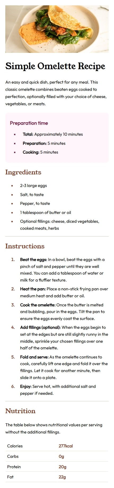

# Frontend Mentor - Recipe page solution

This is a solution to the [Recipe page challenge on Frontend Mentor](https://www.frontendmentor.io/challenges/recipe-page-KiTsR8QQKm). Frontend Mentor challenges help you improve your coding skills by building realistic projects. 

## Table of contents

- [Overview](#overview)
  - [Screenshot](#screenshot)
  - [Links](#links)
- [My process](#my-process)
  - [Built with](#built-with)
  - [What I learned](#what-i-learned)
- [Author](#author)


## Overview

### Screenshot
 <p>Desktop</>

<p>Mobile</p>



### Links

- Solution URL: [Solution URL here](https://github.com/abdullah09c/recipe-page-main.git)
- Live Site URL: [Live site URL here](https://your-live-site-url.com)

## My process

### Built with

- Semantic HTML5 markup
- CSS custom properties

### What I learned

I learned how to add custom fonts to a project from local files and also make website responsive using media queries.


```css
@font-face {
  font-family: 'CustomFont';
  src: url('./fonts/CustomFont.ttf') format('truetype'),
       url('./fonts/CustomFont.ttf') formt('truetype');
  font-weight: normal;
  font-style: normal;
}
```
```css
@media screen and (min-width: 320px) and (max-width: 768px) {
  body {
    font-size: 14px;
  }
}
```


## Author

- Frontend Mentor - [@abdullah09c](https://www.frontendmentor.io/profile/abdullah09c)
- GitHub - [@abdullah09c](https://github.com/abdullah09c)

